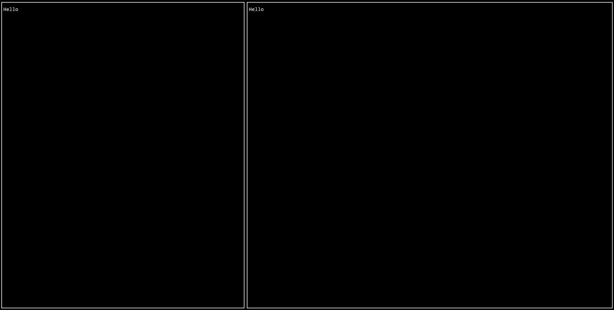

# ratcl

Create complex [ratatui](https://ratatui.rs/) layouts with a simple API.


## Migrating From Version 1 -> 2
```rs
// Version 1
use ratatui::widgets::Paragraph;
use ratcl::{make_cell, rows, columns, EmptyCell};

columns(
    rows(
        make_cell(Paragraph::new("One")),
        make_cell(EmptyCell),
        Constraint::Percentage(52),
    ),
    make_cell(Paragraph::new("Two")),
    Constraint::Length(12),
)(area, buffer);

// Version 2
use ratatui::widgets::Paragraph;
use ratcl::{Rows, Columns, EmptyWidget};

Columns(
    Rows(
        Paragraph::new("One"),
        EmptyWidget,
        Constraint::Percentage(52),
    ),
    Paragraph::new("Two"),
    Constraint::Length(12),
).render(area, buffer);
```

## Create Rows

```rs
use ratatui::{buffer::Buffer, layout::{Constraint, Rect}, widgets::{Paragraph, Widget, Block}};
use ratcl::Rows;

struct SomeStruct;

impl Widget for SomeStruct {
    fn render(self, area: Rect, buffer: &mut Buffer) {
        let block = Block::bordered();
        let paragraph = Paragraph::new("Hello")
            .block(block);

        Rows(
            paragraph.clone(),
            paragraph,
            Constraint::Length(4),
        ).render(area, buffer);
    }
}
```

### Output


## Create Columns

```rs
use ratatui::{buffer::Buffer, layout::{Constraint, Rect}, widgets::{Paragraph, Widget, Block}};
use ratcl::Columns;

struct SomeStruct;

impl Widget for SomeStruct {
    fn render(self, area: Rect, buffer: &mut Buffer) {
        let block = Block::bordered();
        let paragraph = Paragraph::new("Hello")
            .block(block);

        Columns(
            paragraph.clone(),
            paragraph,
            Constraint::Percentage(40),
        ).render(area, buffer);
    }
}
```

### Output


## Create Complex Layouts

```rs
use ratatui::{buffer::Buffer, layout::{Constraint, Rect}, widgets::{Paragraph, Widget, Block}};
use ratcl::{Rows, Columns, EmptyCell};

struct SomeStruct;

impl Widget for SomeStruct {
    fn render(self, area: Rect, buffer: &mut Buffer) {
        let block = Block::bordered();
        let paragraph = Paragraph::new("Hello")
            .block(block);

        Rows(
            paragraph.clone(),
            Columns(
                Rows(
                    InnerStruct::inside(paragraph.clone()),
                    Columns(
                        paragraph.clone(),
                        paragraph.clone(),
                        Constraint::Length(12),
                    ),
                    Constraint::Percentage(17),
                ),
                Columns(
                    Rows(
                        paragraph.clone(),
                        InnerStruct::inside(paragraph.clone()),
                        Constraint::Ratio(2, 7),
                    ),
                    Rows(
                        InnerStruct::inside(EmptyCell),
                        paragraph.clone(),
                        Constraint::Length(9),
                    ),
                    Constraint::Fill(2),
                ),
                Constraint::Percentage(25),
            ),
            Constraint::Length(8),
        ).render(area, buffer);
    }
}

#[derive(Clone)]
struct InnerStruct<Content: Widget + Clone> {
    inside: Content,
}

impl <Content: Widget + Clone> InnerStruct<Content> {
    pub fn inside(content: Content) -> impl Widget + Clone {
        Self {
            inside: content,
        }
    }
}

impl <Content: Widget + Clone> Widget for InnerStruct<Content> {
    fn render(self, area: Rect, buffer: &mut Buffer) {
        let inner_block = Block::bordered();
        let inner_paragraph = Paragraph::new("Inner")
            .block(inner_block);

        self.inside
            .render(area, buffer);

        Columns(
            inner_paragraph.clone(),
            EmptyCell,
            Constraint::Ratio(2, 9),
        ).render(area.inner(Margin::new(4, 2)), buffer);
    }
}
```

### Output

